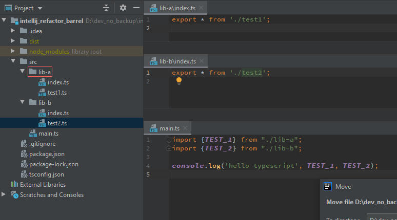
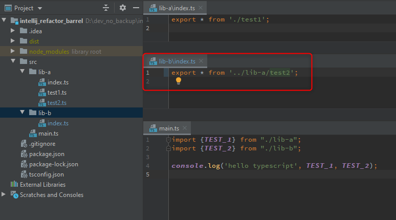
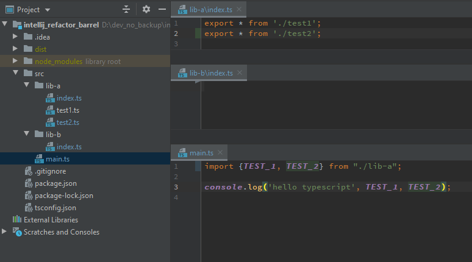

# IntelliJ Refactoring Typescript barrel files 

IntelliJ version: Ultimate 2019.3

## Before refactoring

## Refactoring
Now we move the file `test2.ts` from `lib-b` to `lib-a`:

## Actual Refactoring

Intellij moved the file, but the barrel file `lib-b/index.ts` now has a reference to the file in `lib-a`!

## Expected Refactoring
The expected result is that `test2.ts` should now be exported by the nearest barrel file `lib-a/index.ts`.  
It should be removed from the original barrel `lib-b/index.ts` should now be empty.  
The imports should be updated: e.g. in `main.ts`: `import {TEST_1, TEST_2} from "./lib-a";`

